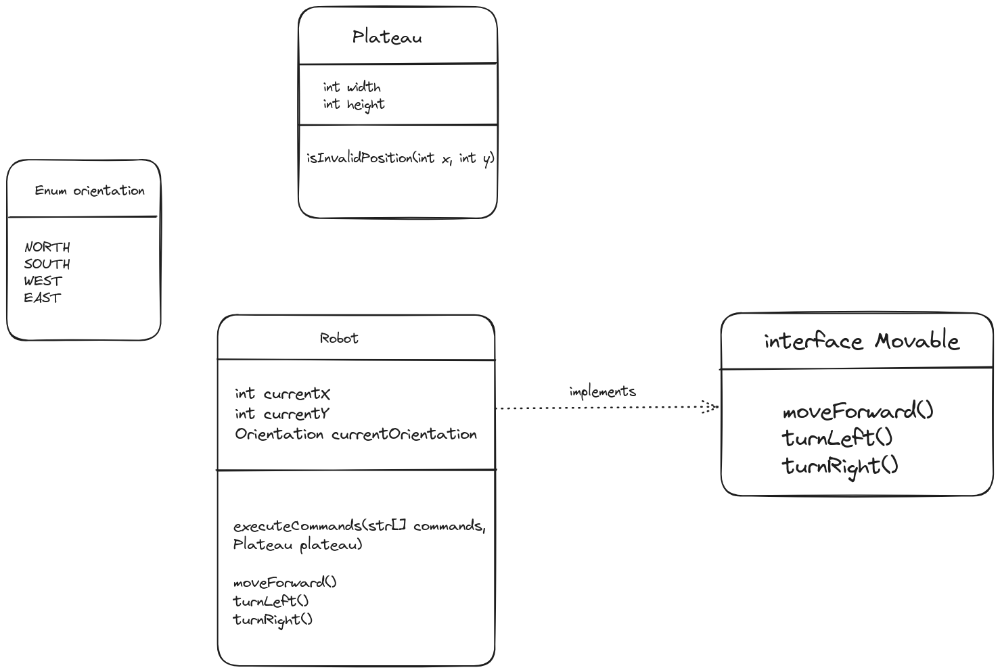

## Rover on mars
A squad of robotic rovers are to be landed by NASA on a plateau on Mars. This plateau, which is curiously rectangular, must be navigated by the rovers so that their on-board cameras can get a complete view of the surrounding terrain to send back to Earth.

A rover's position and location is represented by a combination of x and y
co-ordinates and a letter representing one of the four cardinal compass
points. The plateau is divided up into a grid to simplify navigation. An
example position might be 0, 0, N, which means the rover is in the bottom
left corner and facing North.

In order to control a rover, NASA sends a simple string of letters. **The**
possible letters are 'L', 'R' and 'M'. 'L' and 'R' makes the rover spin 90
degrees left or right respectively, without moving from its current spot.
'M' means move forward one grid point, and maintain the same heading.
Assume that the square directly North from (x, y) is (x, y+1).


## File organization:
- main:
  - Main program: Rover.java
  - Robot/
    - Robot.java: Class Robot
    - Orientation.java: Enum type for orientation
    - Movable.java: Interface for movements
  - Map/
    - Plateau.java: Class Plateau
-  test:
   -  RoverTest.java: Junit test run with input files
   -  resources/inputFiles/: test input files
   -  GenerateLargeTestInput.java: Generator of test with a large number of commands
## Usage
```
Usage: java rover.jar <input file> [-d] 
-d: enable debug mode
```

## Input file format
The input file should be a text file with the following format:
- The first line should contain the last position of the plateau (x, y)
- The following lines should contain the initial position of the rover (x, y, direction) and the commands to move the rover
```
5 5
1 2 N
LMLMLMLMM
3 3 E
MMRMMRMRRM
```

## Build
To build the project, run the following command:
```
mvn clean package
``` 
There will be **rover.jar** at the root of the project

## Test
To run the tests, run the following command:
```
mvn test
```


